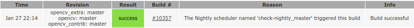
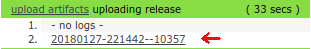
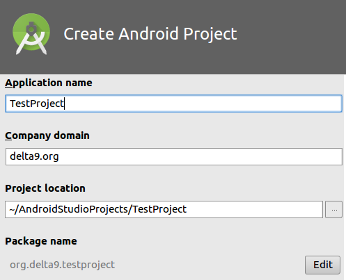

# Intel Delta 9 lectures

Join chat for any kind questions: [](https://gitter.im/intel_delta9/Lobby)

## Image processing language Halide
**Date**: February, 28. 18:00 - 19:20 MSK

## Deep learning with OpenCV on PC, smartphone, in browser
**Date**: February, 28. 19:40 - 21:00 MSK

We'll see several computer vision problems are solved by deep learning models.
Follow [Requirements](#requirements) section if you want to bring laptops or
reproduce the code locally.

### Requirements
Guide the following steps for each of the samples. Execute commands in terminal
(Ubuntu) or using Developer Command Prompt (Microsoft Windows).

#### DL on PC
Human pose estimation using [OpenPose](https://github.com/CMU-Perceptual-Computing-Lab/openpose) model.

* Install python and NumPy on your system

* Download [OpenCV source code](https://github.com/opencv/opencv/archive/master.zip)
or clone it using `git`:

  ```bash
  git clone https://github.com/opencv/opencv.git --depth 1
  ```

* Create `build` folder:

  ```bash
  cd /path/to/opencv
  mkdir build && cd build
  ```

* Build OpenCV modules:

  * Ubuntu
    ```bash
    cmake -DCMAKE_BUILD_TYPE=Release -DBUILD_LIST=dnn,python2,highgui,videoio,imgproc .. && make -j4
    ```

  * Microsoft Windows
    ```bash
    "C:\Program Files\CMake\bin\cmake.exe" -DCMAKE_BUILD_TYPE=Release -DBUILD_LIST=dnn,python2,highgui,videoio,imgproc -G "Visual Studio 14 Win64" ..
    "C:\Program Files\CMake\bin\cmake.exe" --build . --config Release -- /m:4
    ```

* Specify OpenCV location:

  * Ubuntu
    ```bash
    export PYTHONPATH=/path/to/opencv/build/lib:$PYTHONPATH
    ```

  * Microsoft Windows

    Assuming OpenCV installed at `C:\Users\%USERNAME%\opencv\build`
    ```bash
    set PYTHONPATH=C:\Users\%USERNAME%\opencv\build\lib\Release
    set PATH=C:\Users\%USERNAME%\opencv\build\bin\Release;%PATH%
    ```


* Check installation: create a text file `test_opencv.py` with the following python
  code:

  ```python
  import cv2 as cv

  img = cv.imread('example.png')
  cv.imshow('Test OpenCV', img)
  cv.waitKey()
  ```

  Run by `python test_opencv.py` (Ubuntu) or by `C:\Python27\python.exe test_opencv.py` (Microsoft Windows).

* Download files
  1. [Pose estimation .caffemodel](http://posefs1.perception.cs.cmu.edu/OpenPose/models/pose/mpi/pose_iter_160000.caffemodel)
  2. [Pose estimation .prototxt](https://github.com/opencv/opencv_extra/blob/master/testdata/dnn/openpose_pose_mpi.prototxt)

#### DL on smartphone
Recognize gender and age by face. This sample is based on [Age- Gender- recognition networks](https://github.com/GilLevi/AgeGenderDeepLearning)

* Download and install Android Studio

* Create an empty project. Verify it works on you phone. Follow https://github.com/dkurt/delta8#android-studio for details.

* Download the latest [OpenCV for Android](http://pullrequest.opencv.org/buildbot/builders/master_pack-android)

  

  

* Import OpenCV into the project. Follow https://gitpitch.com/dkurt/delta8#/17 or "Add OpenCV dependency" section of https://docs.opencv.org/master/d0/d6c/tutorial_dnn_android.html.

* Check camera permissions by running an application from https://github.com/dkurt/delta9/blob/master/android (replace `activity_main.xml`, `AndroidManifest.xml` and `MainActivity.java` files). In case of problems get camera permissions manually from application's settings.

* NOTE: Do not forget to replace an example package name from `org.delta9.testproject`
to one chosen during project creation. There is one entry in each file.

  

* Download files
  1. [Face detection .caffemodel](https://github.com/opencv/opencv_3rdparty/raw/19512576c112aa2c7b6328cb0e8d589a4a90a26d/res10_300x300_ssd_iter_140000_fp16.caffemodel)
  1. [Face detection .prototxt](https://raw.githubusercontent.com/opencv/opencv/master/samples/dnn/face_detector/deploy.prototxt)
  1. [AgeNet .caffemodel](https://github.com/GilLevi/AgeGenderDeepLearning/raw/master/models/age_net.caffemodel)
  1. [AgeNet .prototxt](https://github.com/GilLevi/AgeGenderDeepLearning/blob/master/age_net_definitions/deploy.prototxt)
  1. [GenderNet .caffemodel](https://github.com/GilLevi/AgeGenderDeepLearning/raw/master/models/gender_net.caffemodel)
  1. [GenderNet .prototxt](https://github.com/GilLevi/AgeGenderDeepLearning/blob/master/gender_net_definitions/deploy.prototxt)

#### DL in browser

Use [Places205-AlexNet](http://places.csail.mit.edu/downloadCNN.html) model for
scene recognition.

* Download files
  1. [OpenCV JavaScript bindings](https://docs.opencv.org/master/opencv.js)
  1. [OpenCV JavaScript utils](https://docs.opencv.org/master/utils.js)
  1. [Places205-AlexNet .caffemodel](https://drive.google.com/open?id=1BpnMdMeoDrY-oBFoPyWFxYMcHZKkxUWP)
  1. Folder https://github.com/dkurt/delta9/blob/master/places205

## Do you like it?

* star OpenPose project: https://github.com/CMU-Perceptual-Computing-Lab/openpose
* star Places365 project: https://github.com/CSAILVision/places365
* star AgeGenderDeepLearning project: https://github.com/GilLevi/AgeGenderDeepLearning
* star OpenCV project: https://github.com/opencv/opencv
